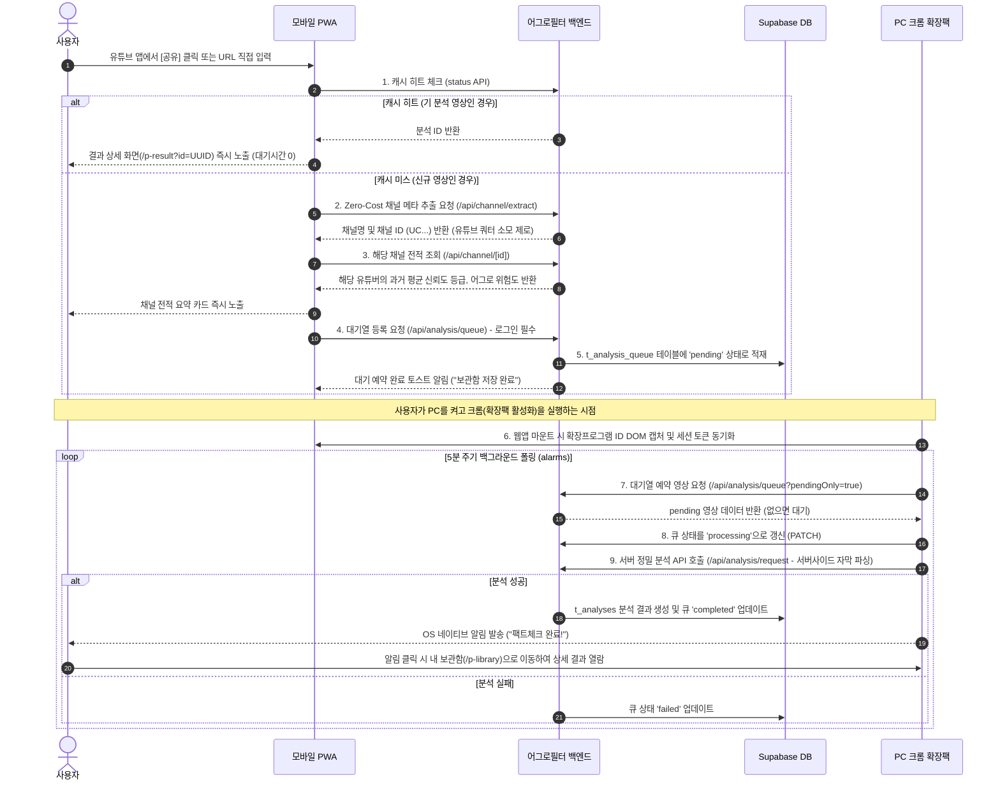

# 📱 NEW: 모바일-PC 크로스디바이스 분석 브릿지 명세 (PWA-Extension Handoff)

본 문서는 모바일 환경의 자막 추출 제약(유튜브 모바일 UI 및 PWA에서의 innertube get_transcript 제한)을 우회하고 크로스 디바이스 연속성을 실현하기 위해 구현된 **Handoff(브릿지) 분석 예약 시스템**의 공식 상세 명세서입니다.

나중에 어그로필터 정식 테스트 및 릴리즈 순서가 되었을 때 본 명세를 참고하여 유효성 검증을 진행합니다.

---

## 1. 시스템 아키텍처 & 흐름 (Flow)

---

## 2. 데이터베이스 스키마 (`t_analysis_queue`)

모바일 예약 영상과 PC 분석 싱크 상태를 관리하기 위해 Supabase DB에 신설된 마이그레이션 구조입니다.

- **테이블**: `t_analysis_queue`
- **인덱스**:
  - `idx_analysis_queue_user_status`: `(f_user_id, f_status)` -> 보관함 조회 성능 극대화
  - `idx_analysis_queue_video_id`: `(f_video_id)` -> 중복 등록 방지 및 캐시 매칭 속도 개선
  - `idx_analysis_queue_status`: `(f_status)` -> 백그라운드 폴링 최적화

| 컬럼명 | 타입 | 제약조건 | 설명 |
| :--- | :--- | :--- | :--- |
| `f_id` | `UUID` | `PRIMARY KEY, DEFAULT gen_random_uuid()` | 대기열 항목 고유 식별자 |
| `f_user_id` | `UUID` | `NOT NULL, REFERENCES family_users(id)` | 예약 요청한 유저 고유 ID (SSO 세션 기반) |
| `f_video_url` | `VARCHAR(512)` | `NOT NULL` | 유튜브 원본 비디오 URL |
| `f_video_id` | `VARCHAR(50)` | `NOT NULL` | 유튜브 비디오 고유 ID (11자리) |
| `f_status` | `VARCHAR(20)` | `DEFAULT 'pending'` | 상태값 (`pending` / `processing` / `completed` / `failed`) |
| `f_created_at` | `TIMESTAMPTZ`| `DEFAULT NOW()` | 예약 생성 시점 |
| `f_updated_at` | `TIMESTAMPTZ`| `DEFAULT NOW()` | 마지막 상태 갱신 시점 |

---

## 3. 백엔드 API 명세

### 3-1. Zero-Cost 유튜브 채널 정보 추출 API
- **Endpoint**: `POST /api/channel/extract`
- **설명**: 유튜브 Data API v3 쿼터를 아끼기 위해 oEmbed 및 채널 홈 HTML의 `og:url` / `externalId` 패턴 매칭을 통해 채널 ID를 무료로 추출합니다.
- **Payload**: `{ "url": "영상 또는 채널 URL" }`
- **Response**: `{ "success": true, "channelId": "UC...", "channelName": "채널명" }`

### 3-2. 분석 대기열 관리 API
- **Endpoint**: `/api/analysis/queue`
- **동작**:
  - **GET**: 현재 로그인된 유저의 대기열 전체 목록 조회. (확장팩 호출용 `?pendingOnly=true` 파라미터 지원)
  - **POST**: 모바일 단독 진입 시 대기열에 pending 상태로 비디오 예약 적재. (중복 방지 처리 완비)
  - **PATCH**: 큐 상태 강제 업데이트 (`pending` ➡️ `processing` ➡️ `completed` or `failed`).
- **인증**: Merlin Hub JWT 토큰 검증(`Authorization: Bearer <token>`) 릴레이 연동.

---

## 4. 프론트엔드 연동 & UX 접점
- **Web Share Target API**: `public/manifest.json` 내 `share_target` 설정을 통해 모바일 기기(안드로이드, iOS PWA 등)의 기본 공유 메뉴에서 어그로필터를 선택해 유튜브 URL을 파라미터(`url` 혹은 `text`)로 자동 전송받음.
- **URL 캡처 폼 (`app/page.tsx`)**: 유입된 URL을 즉시 읽어 `handleSearch`를 트리거하고, 신규 채널인 경우 등급과 점수를 요약 카드 형태로 렌더링.
- **보관함 페이지 (`app/p-library/page.tsx`)**: 로그인한 사용자가 현재까지 예약한 영상들의 상태를 15초 단위 실시간 폴링을 통해 카드 뷰 형태로 제공.
- **세션 자동 동기화 (`components/c-app-header/index.tsx`)**: 어그로필터 사이트에 주입된 확장팩 Content Script가 박아둔 동적 ID(`div#aggrofilter-extension-info` 의 `data-extension-id`)를 웹앱이 마운트될 때 감지하여 로그인 토큰을 확장팩에 자동으로 갱신 릴레이(`SET_SESSION_TOKEN`).

---

## 5. 크롬 확장프로그램 (Chrome Extension)
- **권한 추가**: `manifest.json`에 `alarms`, `notifications` 추가 완료.
- **백그라운드 감시 서비스 워커 (`chrome-extension/background.js`)**:
  - 브라우저 부팅/설치 시 5분 주기의 알람(`queue-polling-alarm`) 등록.
  - 알람 실행 시 동기화되어 저장된 허브 세션 토큰을 헤더에 실어 `GET /api/analysis/queue?pendingOnly=true` 호출.
  - 예약 영상이 잡히면 상태를 `processing`으로 돌려놓고, 백그라운드에서 직접 서버 분석 API `/api/analysis/request`를 쏴서 팩트체크 수행.
  - 분석 완료 시 `completed`로 갱신 후 윈도우/MacOS 화면에 OS 네이티브 푸시 알림 발송. 알림 클릭 시 웹앱의 보관함 페이지로 즉시 탭 오픈 및 이관.
