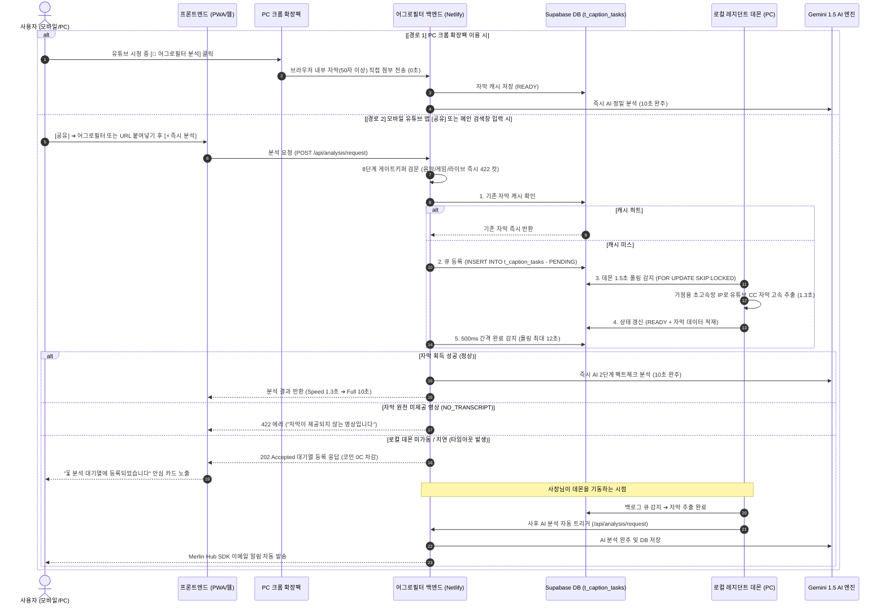

# 📱 하이브리드 로컬 워커 큐 & 크로스디바이스 분석 엔진 명세

> **"PC 크롬 확장팩의 1.5년 독점 굴레를 깨고, 모바일과 PC 어디서나 10초 만에 분석 완결"**  
> 과거 모바일 환경에서 유튜브 자막 스크래핑 제약으로 인해 "PC 확장팩을 켤 때까지 대기"해야 했던 한계를 완전히 극복하고,  
> **상시 레지던트 로컬 워커 데몬과 Supabase 자막 큐(`t_caption_tasks`)**를 연동하여 모바일·웹·PC 전 디바이스에서 초고속 분석을 보장합니다.

---

## 1. 아키텍처 개요 & 동작 흐름

```mermaid
sequenceDiagram
    autonumber
    actor User as 사용자 (모바일/PC)
    participant UI as 프론트엔드 (PWA/웹)
    participant Ext as PC 크롬 확장팩
    participant API as 어그로필터 백엔드 (Netlify)
    participant DB as Supabase DB (t_caption_tasks)
    participant Worker as 로컬 레지던트 데몬 (PC)
    participant AI as Gemini 1.5 AI 엔진

    alt [경로 1] PC 크롬 확장팩 이용 시
        User->>Ext: 유튜브 시청 중 [🚦 어그로필터 분석] 클릭
        Ext->>API: 브라우저 내부 자막(50자 이상) 직접 첨부 전송 (0초)
        API->>DB: 자막 캐시 저장 (READY)
        API->>AI: 즉시 AI 정밀 분석 (10초 완주)
    else [경로 2] 모바일 유튜브 앱 [공유] 또는 메인 검색창 입력 시
        User->>UI: [공유] ➔ 어그로필터 또는 URL 붙여넣기 후 [⚡ 즉시 분석]
        UI->>API: 분석 요청 (POST /api/analysis/request)
        API->>API: 8단계 게이트키퍼 검문 (음악/게임/라이브 즉시 422 컷)
        API->>DB: 1. 기존 자막 캐시 확인
        alt 캐시 히트
            DB-->>API: 기존 자막 즉시 반환
        else 캐시 미스
            API->>DB: 2. 큐 등록 (INSERT INTO t_caption_tasks - PENDING)
            Worker->>DB: 3. 데몬 1.5초 폴링 감지 (FOR UPDATE SKIP LOCKED)
            Worker->>Worker: 가정용 초고속망 IP로 유튜브 CC 자막 고속 추출 (1.3초)
            Worker->>DB: 4. 상태 갱신 (READY + 자막 데이터 적재)
            API->>DB: 5. 500ms 간격 완료 감지 (폴링 최대 12초)
        end
        
        alt 자막 획득 성공 (정상)
            API->>AI: 즉시 AI 2단계 팩트체크 분석 (10초 완주)
            API-->>UI: 분석 결과 반환 (Speed 1.3초 ➔ Full 10초)
        else 자막 원천 미제공 영상 (NO_TRANSCRIPT)
            API-->>UI: 422 에러 ("자막이 제공되지 않는 영상입니다")
        else 로컬 데몬 미가동 / 지연 (타임아웃 발생)
            API-->>UI: 202 Accepted 대기열 등록 응답 (코인 0C 차감)
            UI-->>User: "⏳ 분석 대기열에 등록되었습니다" 안심 카드 노출
            Note over Worker, API: 사장님이 데몬을 기동하는 시점
            Worker->>DB: 백로그 큐 감지 ➔ 자막 추출 완료
            Worker->>API: 사후 AI 분석 자동 트리거 (/api/analysis/request)
            API->>AI: AI 분석 완주 및 DB 저장
            API-->>User: Merlin Hub SDK 이메일 알림 자동 발송
        end
    end
```

---

## 2. 데이터베이스 스키마 (`t_caption_tasks`)

모바일 및 웹 클라이언트의 비동기 자막 추출과 로컬 워커 간의 고속 IPC(통신)를 담당하는 Supabase 원장 테이블입니다.

- **테이블**: `t_caption_tasks`
- **인덱스**:
  - `idx_caption_tasks_status`: `(f_status)` ➔ 데몬 폴링 속도 극대화
  - `idx_caption_tasks_video_id`: `(f_video_id)` UNIQUE ➔ 중복 작업 방지 및 캐시 매칭

| 컬럼명 | 타입 | 제약조건 | 설명 |
| :--- | :--- | :--- | :--- |
| `f_id` | `UUID` | `PRIMARY KEY, DEFAULT gen_random_uuid()` | 작업 고유 식별자 |
| `f_video_id` | `VARCHAR(50)` | `NOT NULL, UNIQUE` | 유튜브 비디오 11자리 고유 ID |
| `f_status` | `VARCHAR(20)` | `DEFAULT 'PENDING'` | 작업 상태 (`PENDING`, `PROCESSING`, `READY`, `NO_TRANSCRIPT`, `FAILED`) |
| `f_transcript` | `TEXT` | `NULL` | 추출된 순수 텍스트 자막 전체 |
| `f_transcript_items` | `JSONB` | `NULL` | 타임스탬프가 포함된 자막 라인 배열 |
| `f_error` | `TEXT` | `NULL` | 실패 사유 기록 |
| `f_user_id` | `TEXT` | `NULL` | 사후 알림 및 코인 처리를 위한 요청 유저 UUID |
| `f_url` | `TEXT` | `NULL` | 사후 자동 완주용 유튜브 원본 URL |
| `f_created_at` | `TIMESTAMPTZ` | `DEFAULT NOW()` | 작업 생성 시점 |
| `f_updated_at` | `TIMESTAMPTZ` | `DEFAULT NOW()` | 마지막 상태 갱신 시점 |

---

## 3. 핵심 구성요소 상세 명세

### 3-1. 로컬 레지던트 데몬 (`scripts/caption_daemon.mjs`)
- **실행 환경**: 사장님 로컬 PC (Node.js 18+).
- **무중단 배치**: `run_caption_worker.bat`을 통해 예기치 않은 에러 발생 시 5초 후 자동 재시작.
- **자막 추출 엔진**: 최신 `youtube-transcript-plus` 기반 (IP 차단 회피력 우수).
- **동시성 안전**: PostgreSQL `SELECT ... FOR UPDATE SKIP LOCKED` 쿼리를 적용하여 다중 워커 구동 시에도 일감 충돌 원천 방지.
- **버스트 모드**: 대기 중인 일감이 있으면 대기시간(1.5초) 없이 즉시 다음 일감을 연속 처리.
- **사후 자동 완주**: 큐에 `f_url`과 `f_user_id`가 지정되어 있는 대기열 작업은 자막 추출 완료 즉시 메인 백엔드의 `/api/analysis/request`를 자동 호출하여 AI 분석을 완주하고 유저에게 이메일 알림 발송.

### 3-2. [B안] 대기열 보관 (202 Queued) 철칙
1. **코인 철통 보호**: 데몬이 꺼져 있어 202 대기열 응답이 나갈 때 유저의 코인은 단 1원도 차감되지 않습니다.
2. **부적격 영상 배제**:
   - 8단계 입구컷 게이트키퍼(음악, 게임, 스포츠, 라이브, 외국어) 대상은 큐에 등록되지 않고 즉시 422 반려됩니다.
   - 유튜브 자체에 CC 자막이 없는 영상(`NO_TRANSCRIPT`)은 대기열이 아닌 즉시 422 안내로 종료됩니다.
   - **오직 적격 분석 대상인데 워커가 오프라인일 때만 대기열에 안전 보관**됩니다.
3. **사용자 경험(UX)**:
   - 프론트엔드(`ResultClient.tsx`)에 "⏳ 분석 대기열에 등록되었습니다 | 🛡️ 코인은 차감되지 않았습니다" 전용 안심 카드가 렌더링됩니다.

### 3-3. 모바일 UX & 디바이스 최적화
- **PWA Web Share Target**: `public/manifest.json`에 `share_target` 설정이 등록되어 있어, 유튜브 앱의 기본 공유 메뉴에서 어그로필터가 네이티브 앱처럼 노출됩니다.
- **맞춤형 온보딩 (`OnboardingGuide`)**:
  - 모바일 접속자: `[📱 모바일 10초 분석법]` 탭이 기본으로 열림.
  - PC 접속자: `[🖥️ PC 크롬 확장팩]` 탭이 기본으로 열림.
- **메인 입력창 원터치**: 복사한 링크를 붙여넣고 `Enter`를 치거나 **[⚡ 즉시 분석]** 버튼을 누르면 즉시 분석이 시작됩니다.

---

## 4. PC 크롬 확장팩과의 완벽한 공존
- PC에서는 크롬 확장팩을 계속 사용할 수 있으며, 확장팩에서 보낸 자막은 큐를 거치지 않고 **0초 즉시 서버로 직행**합니다.
- 추출된 자막은 큐 DB에 캐시(`READY`)로 저장되므로, 다른 모바일 유저가 동일한 영상을 조회할 때도 0초 즉시 재활용됩니다.

---

*Last Updated: 2026-10-01 | Merlin Family Ecosystem*
