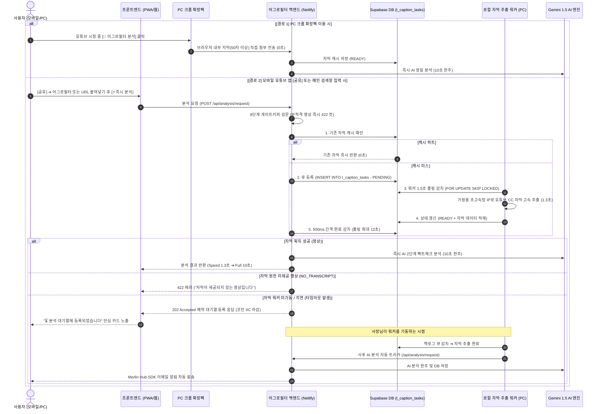

# 🚦 어그로필터 종합 기능명세서 (AggroFilter Master Specification)

> **"유튜브의 어그로와 가짜뉴스를 10초 만에 꿰뚫어 보는 AI 신뢰도 팩트체커"**  
> 본 문서는 어그로필터(AggroFilter)의 아키텍처, 자막 수급 파이프라인, 게이트키퍼 검문, AI 팩트체크 분석 로직, 투트랙 렌더링, 크롬 확장팩 연동, 그리고 Merlin Hub 연동 코인경제까지 서비스 전체를 총괄하는 **유일한 단일 진실 공급원(SSOT)**입니다.

---

## 1. 서비스 개요 및 인프라 토폴로지

- **서비스 공식 도메인**: [https://aggrofilter.sundreamer.app](https://aggrofilter.sundreamer.app)
- **통합 계정/과금 센터(허브)**: [https://os.sundreamer.app](https://os.sundreamer.app) (Merlin Hub)
- **배포 인프라**:
  - **프론트엔드/웹앱**: Netlify Pro (`aggrofilter.sundreamer.app`)
  - **허브 인프라**: Render (`os.sundreamer.app`)
- **데이터베이스 분리 원칙**:
  - **어그로필터 원장 DB**: Supabase PostgreSQL (`iwzwiimyxfduuwulpugu`)
  - **허브 통합 SSOT DB**: Supabase PostgreSQL (`wwopcuitvjldixkyzpzi`)

---

## 2. 모바일 즉시 분석 및 로컬 자막 처리 파이프라인

과거 PC 크롬 확장팩이 설치된 브라우저에서만 가능했던 자막 추출 제약을 완전히 극복하고, 스마트폰(모바일)과 일반 웹 어디서나 유튜브 링크만 입력하면 10초 만에 분석이 완료되는 파이프라인입니다.

### 2-1. 모바일 UI/UX & Web Share Target
- **유튜브 앱 [공유] ➔ [어그로필터]**: `public/manifest.json` 내 `share_target` 설정을 통해 모바일 기기 기본 공유 메뉴에서 어그로필터를 선택하면 즉각 10초 분석 실행.
- **메인 검색창 원터치 즉시 분석**: 유튜브 URL 붙여넣기 후 `Enter` 키 또는 **[⚡ 즉시 분석]** 클릭 시 0초 진입.
- **디바이스 자동 감지 온보딩 (`OnboardingGuide`)**:
  - 모바일 접속 시: `[📱 모바일 10초 분석법]` 탭이 기본으로 열림.
  - PC 접속 시: `[🖥️ PC 크롬 확장팩]` 탭이 기본으로 열림.

### 2-2. 상시 로컬 자막 워커 (`scripts/caption_daemon.mjs` & `run_caption_worker.bat`)
- **실행 환경**: 사장님 로컬 PC (Node.js 18+).
- **무중단 운영**: Windows 배치 스크립트(`run_caption_worker.bat`)로 비정상 종료 시 5초 후 자동 재시작.
- **추출 엔진**: 최신 `youtube-transcript-plus` 탑재 (가정용 통신사 IP로 429 차단율 제로).
- **동시성 안전**: PostgreSQL `SELECT ... FOR UPDATE SKIP LOCKED` 트랜잭션으로 일감 충돌 방지.
- **버스트 모드**: 대기 중인 일감이 있으면 대기시간(1.5초) 없이 즉시 다음 일감을 연속 처리.

### 2-3. 자막 큐 원장 스키마 (`t_caption_tasks`)
| 컬럼명 | 타입 | 제약조건 | 설명 |
| :--- | :--- | :--- | :--- |
| `f_id` | `UUID` | `PRIMARY KEY, DEFAULT gen_random_uuid()` | 작업 고유 식별자 |
| `f_video_id` | `VARCHAR(50)` | `NOT NULL, UNIQUE` | 유튜브 비디오 11자리 고유 ID |
| `f_status` | `VARCHAR(20)` | `DEFAULT 'PENDING'` | 작업 상태 (`PENDING`, `READY`, `NO_TRANSCRIPT`, `FAILED`) |
| `f_transcript` | `TEXT` | `NULL` | 추출된 순수 텍스트 자막 전체 |
| `f_transcript_items` | `JSONB` | `NULL` | 타임스탬프 포함 자막 라인 배열 |
| `f_error` | `TEXT` | `NULL` | 실패 사유 기록 |
| `f_user_id` | `TEXT` | `NULL` | 사후 알림 및 유저 식별용 UUID |
| `f_url` | `TEXT` | `NULL` | 사후 자동 완주용 유튜브 원본 URL |
| `f_created_at` | `TIMESTAMPTZ` | `DEFAULT NOW()` | 작업 생성 시점 |
| `f_updated_at` | `TIMESTAMPTZ` | `DEFAULT NOW()` | 마지막 상태 갱신 시점 |

---

## 3. 자막 서버 일시 부재 시 [예약 접수 & 사후 알림] 시스템

자막 추출 프로그램(로컬 워커)이 일시적으로 꺼져 있거나 12초 내 응답하지 못할 경우, 유저를 에러로 실패시키지 않고 대기열에 안전하게 예약 접수합니다.

1. **코인 철통 보호**: 예약 접수 시 **유저 코인은 단 1원도 차감되지 않음 (0C)**.
2. **부적격 영상 원천 배제**:
   - 8단계 게이트키퍼(음악, 게임, 스포츠, 라이브 등) 탈락 영상은 큐에 등록되지 않고 즉시 422 반려.
   - 유튜브 CC 자막이 원천 제공되지 않는 영상(`NO_TRANSCRIPT`)은 대기열이 아닌 즉시 422 안내로 종료.
   - **오직 적격 분석 대상인데 워커가 오프라인일 때만 예약 대기열에 등록**.
3. **프론트엔드 안심 카드 (`ResultClient.tsx`)**:
   - "⏳ 분석 대기열에 등록되었습니다 | 🛡️ 코인은 차감되지 않았습니다 | 분석 완료 시 이메일 및 보관함으로 즉시 안내" 카드 노출.
4. **사후 자동 완주 & 이메일 알림**:
   - 사장님이 PC를 켜고 워커를 가동하는 즉시 미완료 일감(`PENDING`)을 감지하여 1초 만에 자막 추출.
   - 워커가 메인 백엔드 `/api/analysis/request`를 자동 호출하여 AI 분석을 완주하고 DB에 적재.
   - 유저에게 Merlin Hub SDK를 통해 등록 이메일로 분석 완료 안내 자동 발송.

---

## 4. 입구컷 8단계 게이트키퍼 (비용 99% 철통 방어)

본 분석(Gemini API) 진입 전 최상단(394~603행)에서 부적격 콘텐츠를 즉시 422 차단하여 AI 비용 누출을 원천 방어합니다:

1. **Title Guard (GPT-4o-mini)**: 코미디(23), 엔터(24), 자동차(2), 여행(19) 등 모호 카테고리의 정보성/리뷰 가치를 제목+채널명(80토큰)만으로 0.2초/0.0008원에 사전 판별.
2. **단순 음악 영상 (MV/노래가사)**: M/V, Official Video, 노래 가사, 안무 영상 등 즉시 차단 (422).
3. **실시간 라이브 & 다시보기/하이라이트**: 실제 생방송 중인 영상 및 저품질 녹화본/풀영상 차단 (422).
4. **단순 줄거리 요약/결말 정리**: 논평 없는 단순 내용 요약/몰아보기 영상 차단 (422).
5. **단순 게임 플레이 (카테고리 20)**: 리뷰/비평 키워드가 없는 단순 플레이/솔랭/파밍 영상 차단 (422).
6. **단순 스포츠 경기 중계 (카테고리 17)**: 풀매치, 중계, 단순 하이라이트, 공식 방송사 중계 차단 (422).
7. **단순 영화/공연 재생 (카테고리 1, 24)**: 전편보기, 풀버전, 콘서트 전체공연 차단 (422).
8. **외국어/비한국어**: 일본어 가나 문자 포함 영상 및 한글 미포함 영상 차단 (422).
9. **CC 무자막 영상 (`NO_TRANSCRIPT`)**: 유튜브 CC 자막이 원천 제공되지 않는 영상 즉시 차단 (422).

---

## 5. 제로대기 비동기 AI 투트랙 (Two-Track)

사용자가 대기 시간 없이 즉시 결과를 열람할 수 있도록 2단계 비동기 렌더링을 적용합니다.

- **Track B (Speed 트랙 - 1.3초)**:
  - 자막 획득 즉시 3줄 핵심 요약 및 썸네일 스포일러(위치/시간/출처)를 우선 생성하여 초기 체감 속도 극대화.
- **Track A (Full 정밀 분석 - 10초)**:
  - Gemini 팩트체크 선행 검색을 거쳐 최종 어그로/정확성/신뢰도 점수 및 평가 사유, 착한 추천 제목 산출.
- **Completed 마감**:
  - `processingStage = completed` 수신 즉시 ScoreCard 및 분석 광장/댓글 전체 섹션 렌더링.

---

## 6. 전주기 AI 분석 로직 & 점수 산출 공식

### 6-1. 2단계 팩트체크 선행 아키텍처
1. **1단계: 검색 필요성 판정 및 키워드 추출**:
   - 모델: `gemini-2.5-flash-lite` (도구 OFF, 2~4초)
   - 시사, 정치, 인물, 폭로, 최신 기술 등 사실 확인이 필요한지 검토 후 최적 구글 검색어 1~3개 도출.
2. **2단계: 최종 원샷 분석 및 채점**:
   - 모델: `gemini-2.5-flash` (10초)
   - `needs_grounding: true` 시 구글 검색 도구(`googleSearch: {}`) 활성화하여 검색 결과를 선행 확보 후 일관성 있게 채점.

### 6-2. 점수 산출 공식 및 신호등 등급
- **신뢰도 점수 공식**:
  $$\text{신뢰도} = \frac{\text{정확성} + (100 - \text{어그로성})}{2}$$
- **신호등 등급**:
  - **70점 이상**: 🟢 **녹색불 (안심)**
  - **50 ~ 69점**: 🟡 **노란불 (주의)**
  - **50점 미만**: 🔴 **빨간불 (경고)**
- **착한 추천 제목**: 어그로성이 30% 이상일 경우 과장/자극 요소를 배제한 건전한 대체 제목 자동 생성.

---

## 7. PC 크롬 확장팩 (Chrome Extension) 공존

- **원클릭 분석 버튼**: 유튜브 시청 중 영상 제목 바로 아래 `[🚦 어그로필터 분석]` 버튼 자동 삽입.
- **0초 무지연 자막 Handoff**: 브라우저 런타임 메모리에서 자막을 직접 수집하여 백엔드로 직송 (대기열 스킵).
- **클라우드 캐시 기여**: 확장팩으로 분석된 자막은 Supabase `t_caption_tasks`에 즉시 캐시(`READY`)로 저장되어, 이후 모바일 유저가 동일 영상을 조회할 때 0초 만에 재활용.

---

## 8. Merlin Hub SDK 연동 & 코인경제 / 과금 정책 (v2.6)

1. **단일 이메일 OTP 인증**:
   - 소셜 로그인 및 로컬 인증 일체 금지. Merlin Hub(`wwopcuitvjldixkyzpzi`) 주도의 6자리 이메일 OTP 단일 인증 체제.
2. **30일 롤링 세션 & SSO 연속성**:
   - 활성 이용 중 30일 세션 자동 갱신 및 패밀리 앱 간 끊김 없는 자동 로그인 유지.
3. **코인 과금 체계 (토큰 종량제 미터기 완전 폐지)**:
   - **신규 영상 분석**: 영상 길이 불문 **일괄 50C 단일가** 차감 (`ANALYZE_VIDEO`).
   - ⭐ **채널 소유자 재검수**: 채널 주인의 최신 재검수 요청 시 **1,000C 고정** (`REANALYSIS_OWNER`).
   - **캐시 열람**: 기 분석된 영상은 **0C 무료 열람** (단, 광고 노출).
4. **광고 타임패스 (24시간 무광고)**:
   - 50C 분석 결제 즉시 **24시간 동안 사이드/하단 광고 100% 자동 제거** (`ad_free_until`).
   - 단순 캐시 열람(0C) 유저에게는 광고를 노출하여 애드센스 수익 창출.
5. **비회원 1회 선체험 & 가불 정산 (Anonymous First)**:
   - 비로그인 유저도 1회 무료 체험 허용 ➔ 분석 비용은 로컬스토리지에 가불금(`pending_usage_fee`)으로 보관.
   - 유저가 이후 로그인(이메일 OTP) 시, 허브 백엔드가 원자적으로 가불금을 차감하고 `/api/analysis/link-guest`를 호출하여 분석 데이터 소유권(`f_user_id`)을 정식 UUID로 즉시 이관.
6. **통합 이메일 알림**:
   - 인앱 푸시를 걷어내고, 분석 완료 및 등급 변경 시 Merlin Hub SDK를 통한 유저 이메일 발송으로 일원화.

---

## 9. 카테고리 및 랭킹 시스템

- **7대 공식 핵심 카테고리**:
  - 뉴스/정치(25), 인물/블로그(22), 교육(27), 엔터테인먼트(24), 노하우/스타일(26), 과학기술(28), 비영리/사회운동(29)은 각각 독립된 카테고리 탭과 전용 랭킹 제공.
- **#기타 (ID: 100) 통합 랭킹**:
  - 코미디(23), 자동차(2), 여행(19), 영화(1), 스포츠(17), 게임(20) 등에서 1단계 게이트키퍼를 통과한 영상/채널들은 DB 고유 카테고리를 유지하며, UI 랭킹/필터에서는 **`#기타 (100)`** 로 자동 통합 집계.

---

*Last Updated: 2026-10-01 | Merlin Family OS*
