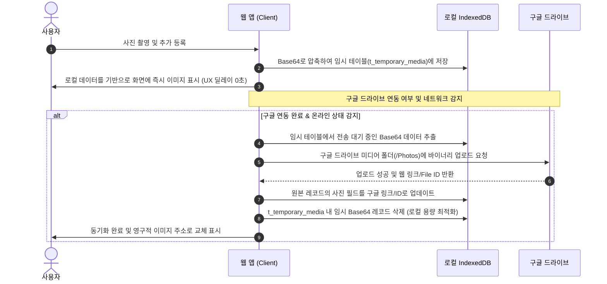

# 💾 [표준] 로컬 DB & 구글 드라이브 하이브리드 동기화 아키텍처 가이드
**Local-First Hybrid Cloud Synchronization Standard Specification**

본 문서는 로컬 데이터베이스(IndexedDB)와 구글 드라이브(Google Drive) 백업 스토리지를 연동하여, 네트워크 상태나 구글 연동 여부와 관계없이 최고의 사용자 경험(UX)을 보장하고 로컬 브라우저 저장소의 용량 한계(5MB)를 지능적으로 해결하는 하이브리드 동기화 표준 스펙을 정의합니다.

---

## 1. 개요 및 설계 원칙

가계부, 식단 관리 등 사용자의 개인 정보와 이미지/미디어 자원을 함께 관리하는 PWA(Progressive Web App) 서비스는 다음과 같은 저장소 한계와 오프라인 극복 과제를 안고 있습니다:
1. **로컬 스토리지의 한계**: 브라우저의 `localStorage`는 최대 **5MB**의 용량 제한을 가지며 동기식(blocking)으로 작동하므로 대용량 텍스트나 Base64 이미지를 보관하기에 부적합합니다.
2. **구글 연동의 간헐성**: 사용자가 항상 구글 계정을 연동해 두거나 온라인 상태인 것은 아닙니다. 연동이 비활성화된 오프라인 상태에서도 즉각적인 앱 기능 수행이 가능해야 합니다.

### 💡 하이브리드 동기화 원칙 (Hybrid Sync Principle)
- **오프라인 우선 (Offline-First)**: 모든 데이터 쓰기와 미디어 추가는 로컬 데이터베이스에 즉시 반영되어 유저가 체감하는 랙(Lag)이 없어야 합니다.
- **클라우드 위임 (Cloud Delegation)**: 무거운 바이너리 미디어 데이터는 구글 드라이브가 연동되는 시점에 백그라운드에서 드라이브 공간으로 자동 업로드하고, 로컬 DB에는 가벼운 웹 링크/File ID 정보만 남겨두어 로컬 디스크 공간을 영구적으로 확보합니다.

---

## 2. 하이브리드 저장소 아키텍처 (Storage Architecture)

하이브리드 동기화는 아래의 두 저장소 계층을 유기적으로 연동하여 관리합니다.

```
[클라이언트 브라우저]                               [구글 클라우드]
+---------------------------------------+         +-------------------------------+
|  1. IndexedDB (비동기 대용량 스토어)   |         | 2. Google Drive               |
|  - 메타데이터 및 가계부 내역            |  Sync   | - appDataFolder (비공개 백업)  |
|  - 임시 Base64 바이너리 이미지 데이터  |=======> | - Public Folder (공개 이미지) |
+---------------------------------------+         +-------------------------------+
```

### 1) 로컬 DB: IndexedDB 표준화
- **용량 제약 극복**: IndexedDB는 브라우저 잔여 디스크 용량에 따라 최대 **수백 MB~수 GB**까지 데이터를 비동기(async) 방식으로 저장할 수 있습니다.
- **임시 버퍼 역할**: 미디어 등록 시 IndexedDB의 `t_temporary_media` 테이블에 Base64 형식으로 임시 적재하여 오프라인 상태에서도 즉시 이미지를 조회할 수 있게 돕습니다.

### 2) 클라우드: 구글 드라이브 구조화
- **메타데이터 백업**: 유저가 일반 드라이브 화면에서 지우거나 편집하지 못하도록 격리된 앱 비공개 저장소인 `appDataFolder`를 활용합니다.
- **바이너리 미디어 스토리지**: 유저 드라이브 루트 또는 `appDataFolder` 하위에 명확한 미디어 폴더(예: `/Photos`)를 생성하여 유저별 미디어 원본을 구조화하여 적재합니다.

---

## 3. 동기화 및 라이프사이클 시나리오



### 1) 오프라인 / 미연동 시의 쓰기
1. 사용자가 이미지를 업로드하면, 클라이언트 단에서 이미지의 해상도와 품질을 압축(예: canvas를 통한 jpeg 압축)합니다.
2. 압축된 Base64 데이터를 IndexedDB의 임시 미디어 테이블에 저장하고, 가계부/음식 레코드에는 임시 로컬 키(또는 blob url)를 매핑합니다.
3. 사용자는 네트워크 지연 없이 등록 결과를 즉시 확인할 수 있습니다.

### 2) 백그라운드 동기화 (Background Synchronization)
1. 구글 연동이 활성화되거나 인터넷 연결이 복구되면 동기화 매니저(Sync Manager)가 기동합니다.
2. 동기화 매니저는 IndexedDB에서 구글 드라이브에 업로드되지 않은 임시 이미지 목록을 큐(Queue) 형태로 가져옵니다.
3. 구글 드라이브 API를 호출하여 순차적으로 사진을 업로드하고, 반환된 구글 드라이브 `webContentLink` 또는 고유 `fileId`를 획득합니다.
4. 원본 레코드의 사진 참조 필드를 구글 드라이브 링크로 치환한 후, IndexedDB에 존재하던 무거운 Base64 데이터를 제거하여 로컬 저장 용량을 안전하게 환수합니다.

---

## 4. 이중 백업 로테이션 표준 규격 (Double Backup Rotation)

유저 데이터 메타데이터(JSON)의 백업은 유실 및 휴먼 에러를 방지하기 위해 **Latest-Dated 롤링 기법**을 적용하여 관리합니다.

### 1) 백업 파일 구성
- **Latest 최신 파일 (`{app_name}_backup_latest.json`)**: 가장 마지막에 저장된 최신 상태를 복구하기 위한 메인 백업 파일입니다.
- **Dated 세대별 백업 파일 (`{app_name}_backup_YYYYMMDD_HHmmss.json`)**: 과거 시점으로의 복구(Point-in-Time Recovery)를 지원하기 위한 히스토리성 백업본입니다.

### 2) 순환 교체(Rotation) 및 클린업 정책
1. 백업 트리거 시 최신 상태를 `latest.json`에 덮어쓰기 전에, 기존 `latest.json`의 메타데이터를 백그라운드에서 읽어 dated 백업본으로 안전하게 1본 복사해 둡니다.
2. 클라우드 용량 관리를 위해 구글 드라이브에 저장된 dated 백업본의 개수를 조회합니다.
3. dated 백업본 개수가 **최대 세대 수 제한(예: 7세대)**을 초과할 경우, 수정 일시(`modifiedTime`)가 가장 오래된 백업 파일을 구글 드라이브 DELETE API를 통해 삭제하여 세대를 순환(Rolling) 유지합니다.

---

## 5. 결론 및 기대 효과

본 하이브리드 동기화 표준 아키텍처를 적용할 경우 다음과 같은 이점을 얻을 수 있습니다:
- **무중단 사용자 경험**: 네트워크 오프라인이나 구글 연동이 없는 환경에서도 가계부 작성 및 사진 업로드가 끊김 없이 즉시 이루어집니다.
- **무한에 가까운 미디어 저장소**: 브라우저의 5MB 용량 한계에 제한받지 않고 사용자의 개인 구글 드라이브 용량(기본 15GB 무료)을 미디어 서버처럼 확장하여 사용할 수 있습니다.
- **완벽한 데이터 안정성**: 7세대 자전 백업과 로컬 IndexedDB 캐싱의 결합을 통해 네트워크 단절, 브라우저 강제 종료 등 어떠한 비정상 시나리오에서도 데이터의 무결성을 유지합니다.
