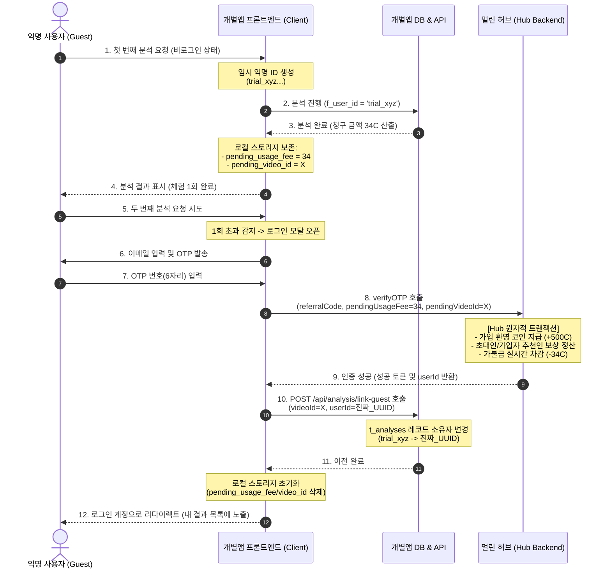

# 🐾 비회원 선(先) 체험 가불 정산 및 데이터 이관 가이드
**Anonymous Experience, Deferred Payment & Data Migration Standard (v1.0)**

본 문서는 멀린 패밀리 생태계 내 모든 개별 애플리케이션(어그로필터 등)에서 **비로그인 사용자(게스트)의 진입 장벽을 완전히 낮추고(1회 선 체험 제공), 로그인 가입 완료 시 체험 데이터와 요금을 계정으로 매끄럽게 흡수(마이그레이션)**하기 위한 기술 표준과 실전 연동 스펙을 정의합니다.

---

## 🗺️ 1. 아키텍처 개요 (Architecture Overview)

유저에게 가입이나 결제를 요구하기 전에 서비스의 핵심 가치(맛보기)를 1회 경험하게 하고, 가입 시 제공되는 웰컴 코인(`500C`)에서 당시 발생한 분석료를 사후 차감함과 동시에 해당 분석 이력을 로그인 계정으로 이관합니다.

### 🔄 핵심 시퀀스 다이어그램 (Sequence Diagram)



---

## 💾 2. 임시 상태 데이터 보존 정책 (State Retention Policy)

### 📌 브라우저 로컬 스토리지(LocalStorage)의 수명 주기
- **유효성**: **반영구적 (Permanent)**
- **특징**: `SessionStorage`는 브라우저 창이나 탭을 닫으면 소멸하지만, `LocalStorage`는 사용자가 브라우저 캐시 및 사이트 데이터를 직접 초기화하거나 시크릿 모드 창을 닫기 전까지는 컴퓨터를 재부팅하거나 일주일 뒤에 재진입해도 **완벽하게 유지**됩니다.
- **활용**: 게스트가 첫 번째 체험을 한 뒤 당일 로그인을 하지 않고 나가더라도, 다음 날 다시 돌아와 가입하면 정상적으로 가불 정산과 데이터 연동이 성공합니다.

### 🗂️ 사용되는 스토리지 키 스펙 (Storage Keys)

| 스토리지 키 | 타입 | 예시값 | 설명 |
| :--- | :--- | :--- | :--- |
| `anonAnalysisCount` | `string(number)` | `"1"` | 익명 상태에서 분석을 실행한 횟수 (1 이상 시 로그인 강제) |
| `pending_usage_fee` | `string(number)` | `"34"` | 맛보기 분석 시 발생한 실제 가불 코인 금액 |
| `pending_video_id` | `string` | `"dQw4w9WgXcQ"` | 맛보기로 분석한 비디오 ID (또는 로컬 고유 키) |
| `pendingReferralCode`| `string` | `"REF123"` | 유저가 초대 링크(`?ref=...`)로 진입했을 시 임시 보관할 추천 코드 |

---

## 🗄️ 3. DB 스키마 및 마이그레이션 정책

### 1) 최초 분석자 식별자 (`f_user_id`)
개별앱의 분석 내역 테이블(`t_analyses`)에는 분석을 요청한 사람을 명시하는 **`f_user_id`** 필드가 존재합니다.
- **익명 분석 시**: 클라이언트에서 임의로 조합한 유니크 식별자(`trial_` + 타임스탬프 + 난수)를 `f_user_id` 컬럼에 인서트하여 관리합니다.
  - 예시: `trial_lh3z2j_b92df1`
- **정식 로그인 시**: 계정 발급 후 이 임시 식별자(`trial_%`) 레코드를 진짜 유저의 통합 UUID(`family_users.id`)로 변경(UPDATE)해 줍니다.

---

## 💻 4. 실전 연동 가이드 및 소스코드 스펙

### 1) 개별앱 클라이언트단 연동 패턴 (Client-Side)

유저가 OTP 인증에 최종 성공하면 로컬 스토리지에 적재되어 있던 가불 정보를 꺼내어 허브 SDK의 `verifyOTP`에 전달하고, 인증이 끝나자마자 로컬 DB 연동 API를 호출합니다.

#### 📁 `components/c-login-modal/index.tsx` 의 인증 완료 콜백 예시
```typescript
const verifyCode = async (fullCode: string) => {
  setIsLoading(true);
  setError("");
  try {
    // 1. 로컬 스토리지에서 가불 정산용 데이터 및 추천인 코드 추출
    const referralCode = localStorage.getItem('pendingReferralCode') || undefined;
    const pendingUsageFeeStr = localStorage.getItem('pending_usage_fee');
    const pendingUsageFee = pendingUsageFeeStr ? parseInt(pendingUsageFeeStr, 10) : undefined;
    const pendingVideoId = localStorage.getItem('pending_video_id') || undefined;

    // 2. 멀린 허브 통합 OTP 인증 실행 (가불 정산 및 가입 축하금 원자적 처리)
    const result = await verifyOTP(email, fullCode, 'AGGRO_FILTER', referralCode, pendingUsageFee, pendingVideoId);
    if (!result.success) {
      setError(result.error || '인증 코드가 올바르지 않습니다.');
      return;
    }

    // 3. 로컬 DB 연동: 익명 시절의 영상 소유권을 정식 유저 ID로 마이그레이션
    if (pendingVideoId && result.userId) {
      try {
        await fetch('/api/analysis/link-guest', {
          method: 'POST',
          headers: { 'Content-Type': 'application/json' },
          body: JSON.stringify({ videoId: pendingVideoId, userId: result.userId })
        });
        console.log(`[Success] Guest analysis ${pendingVideoId} linked to User ${result.userId}`);
      } catch (linkErr) {
        console.error('[Error] Failed to link guest analysis:', linkErr);
      }
    }

    // 4. 로컬 스토리지 정리
    localStorage.removeItem('pending_usage_fee');
    localStorage.removeItem('pending_video_id');
    localStorage.removeItem('pendingReferralCode');
    
    // 5. 로그인 성공 처리
    onLoginSuccess(result.email, result.userId);
  } catch (err) {
    console.error(err);
    setError('인증 중 오류가 발생했습니다.');
  } finally {
    setIsLoading(false);
  }
};
```

---

### 2) 개별앱 백엔드 연동 패턴 (Server-Side)

개별앱 내부 API에 익명 영상의 `f_user_id` 소유권을 진짜 로그인 유저 ID로 업데이트해 주는 엔드포인트를 제공합니다.

#### 📁 `app/api/analysis/link-guest/route.ts` API 라우트 예시
```typescript
import { NextResponse } from 'next/server';
import { pool } from '@/lib/db';

export const runtime = 'nodejs';

export async function POST(request: Request) {
  try {
    const { videoId, userId } = await request.json();
    if (!videoId || !userId) {
      return NextResponse.json({ error: 'Missing parameters' }, { status: 400 });
    }

    const client = await pool.connect();
    try {
      // f_video_id가 일치하고 f_user_id가 게스트(trial_...)이거나 지정되지 않은 레코드를 일괄 업데이트
      const res = await client.query(`
        UPDATE t_analyses 
        SET f_user_id = $1 
        WHERE f_video_id = $2 AND (f_user_id LIKE 'trial_%' OR f_user_id IS NULL)
      `, [userId, videoId]);

      console.log(`[Link Guest] Linked video ${videoId} to user ${userId}. Updated rows: ${res.rowCount}`);
      return NextResponse.json({ success: true, updatedCount: res.rowCount });
    } finally {
      client.release();
    }
  } catch (err: any) {
    console.error('[Link Guest API] Exception:', err.message);
    return NextResponse.json({ error: err.message }, { status: 500 });
  }
}
```

---

## 🙋‍♂️ 5. 자주 묻는 질문 (FAQ)

> **Q. 익명 사용자가 첫 맛보기 영상 분석 후, 회원가입 모달을 그냥 닫고 나가면 어떻게 되나요?**
- 아무 문제 없습니다! 로컬 스토리지에 가불금 정보가 보존된 채로 사이트를 탐색할 수 있으며, 이후 마이페이지나 다른 링크를 통해 로그인을 시도할 때 스토리지에 있던 가불 정산 스펙이 즉시 가입 프로세스로 전달되어 자동 청산됩니다.

> **Q. 만약 익명 유저가 브라우저의 '시크릿 모드(Incognito)'에서 체험한 뒤 가입하려 하면 어떻게 되나요?**
- 시크릿 모드는 창을 열어둔 상태에서는 로컬 스토리지가 정상 작동하므로, **창을 닫기 전에 인증을 완료하면 정상적으로 마이그레이션이 성공**합니다. 다만 창을 완전히 닫은 후 다시 들어와 가입할 경우 로컬 스토리지가 소멸하므로 가불금 청구 및 데이터 이전은 누락됩니다. (이 경우 그냥 순수 가입자로 인식되어 500C가 온전히 적립됩니다.)

---

### ⚠️ [CRITICAL] 로그인 세션 로딩 지연(isLoading) 대기 지침

개별 앱 프론트엔드에서 허브 SDK(`useHub`)를 통해 세션 상태를 가져올 때, 아래 사항을 절대 준수해야 합니다.
- **로딩 대기 필수**: `useHub()`가 반환하는 `isLoading` 상태가 `true`인 동안에는 유저 세션 정보 조회가 아직 진행 중입니다. 이 시점에는 사용자가 로그인 회원인지 게스트인지 정확하게 판정할 수 없습니다.
- **레이스 컨디션 차단**: `isLoading === true`일 때 분석 요청이나 `trial_` ID 발급 로직이 즉시 실행되지 않도록 제어해야 합니다. 이 분기 처리가 누락되면 **로그인 회원 브라우저에서 임시 `trial_` ID가 먼저 생성되어 서버로 전송되고, 결과적으로 회원 코인 과금이 누락되는 레이스 컨디션 버그**가 발생합니다.
- **올바른 구현 예시**:
  ```typescript
  const { user, isLoggedIn, isLoading } = useHub();
  
  useEffect(() => {
    if (isLoading) return; // 세션 로드가 완전히 완료될 때까지 대기
    
    // 로드 완료된 후의 분석 시작 또는 임시 ID 발급 로직 진행
    bootstrap();
  }, [isLoading]);
  ```

---

## 🎯 6. 타 패밀리 앱 개발자를 위한 체크리스트

1. **임시 ID 식별 규칙 준수**: 게스트 최초 액션 실행 시 `trial_`로 시작하는 유일 문자열을 로컬 DB의 사용자 식별 컬럼에 인서트하십시오.
2. **차감 예약 및 바인딩**: 분석 단가가 산출되는 즉시 로컬 스토리지의 `pending_usage_fee`에 금액을, `pending_video_id`에 행 식별 키를 세팅하십시오.
3. **통합 SDK 정산 연동**: 로그인 OTP 인증 API 호출 시 `pendingUsageFee`와 `pendingVideoId` 인자를 누락 없이 매핑하십시오.
4. **마이그레이션 엔드포인트 구현**: `/api/analysis/link-guest`와 동일한 레코드 소유자 변경 API를 개별 앱 내에 마련하고, 로그인 직후 백그라운드 호출을 강제하십시오.
5. **세션 동기화 대기 처리**: `useHub()`의 `isLoading` 플래그를 통한 비동기 대기 처리가 올바르게 구현되었는지 검증하십시오.

---

> **[🛡️ 작업 강령 Reminder]**
> 본 문서의 모든 스펙은 멀린 패밀리 앱의 표준 규격입니다. 신규 어플리케이션을 연동하는 다음 세션의 AI 및 개발진은 이 데이터 흐름 규격을 100% 준수하여 게스트 무마찰 경험(Frictionless UX)을 일관되게 제공해야 합니다.
